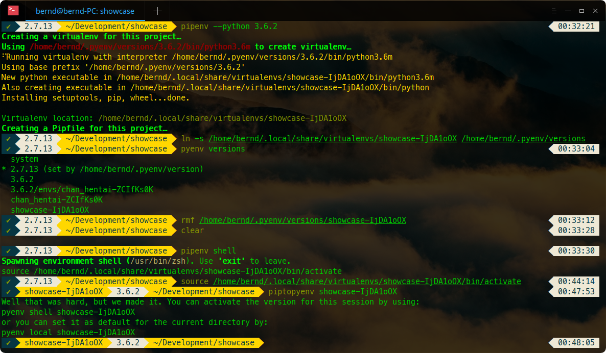

# ZSH Configuration
Hello me. If you are not me, hello to you. This is my personal
zsh_configuration linux for distributions.


For the mac version click [here](https://github.com/Nachtalb/zsh_configuration.mac) (Not up to date).

<!-- toc -->

- [Screenshots](#screenshots)
- [Installation](#installation)
  * [Installing ZSH](#installing-zsh)
  * [Installing Oh My Zsh](#installing-oh-my-zsh)
    + [via curl](#via-curl)
    + [via wget](#via-wget)
  * [Configure Oh My Zsh](#configure-oh-my-zsh)
    + [Installing Oh My Zsh Theme](#installing-oh-my-zsh-theme)
    + [Installing Oh My Zsh Plugins](#installing-oh-my-zsh-plugins)
  * [Clone This Repository](#clone-this-repository)
    + [Install Repository](#install-repository)
    + [Configure Repository](#configure-repository)

<!-- tocstop -->

## Screenshots


Deepin Linux Terminal.

## Installation

### Installing ZSH
```bash
sudo apt install zsh
```
### Installing Oh My Zsh

[Oh My Zsh](http://ohmyz.sh/)

#### via curl
```bash
sh -c "$(curl -fsSL https://raw.githubusercontent.com/robbyrussell/oh-my-zsh/master/tools/install.sh)"
```
#### via wget
```bash
sh -c "$(wget https://raw.githubusercontent.com/robbyrussell/oh-my-zsh/master/tools/install.sh -O -)"
```

### Configure Oh My Zsh
#### Installing Oh My Zsh Theme
[Powerlevel9k](https://github.com/bhilburn/powerlevel9k)
```bash
git clone https://github.com/bhilburn/powerlevel9k.git ${HOME}/.oh-my-zsh/custom/themes/powerlevel9k
```
You should also install a powerline capable font, like this one: [Meslo](https://github.com/powerline/fonts/blob/master/Meslo%20Slashed/Meslo%20LG%20M%20Regular%20for%20Powerline.ttf)

#### Installing Oh My Zsh Plugins
[zsh-syntax-highlighting](https://github.com/zsh-users/zsh-syntax-highlighting)
```bash
git clone https://github.com/zsh-users/zsh-syntax-highlighting.git ${ZSH_CUSTOM}/.oh-my-zsh/custom}/plugins/zsh-syntax-highlighting
```

[zsh-autosuggestions](https://github.com/zsh-users/zsh-syntax-highlighting)
```bash
git clone git://github.com/zsh-users/zsh-autosuggestions $ZSH_CUSTOM/plugins/zsh-autosuggestions
```

### Clone This Repository
#### Install Repository
Clone the repository into `home/.zsh`
```bash
git clone https://github.com/Nachtalb/zsh_configuration.linux.git ${HOME}/.zsh
```
Remove the `.zshrc` in your home directory
```bash
rm ${HOME}/.zshrc
```
Create a symlink to this repositories `.zshrc`
```bash
ln -s ${HOME}/.zsh/.zshrc ${HOME}/.zshrc
```
#### Configure Repository
Replace `[username]` with you current users name. Like this the you remove the 
`username@computername` on the left side of your input.
```bash
DEFAULT_USER=[username]
```